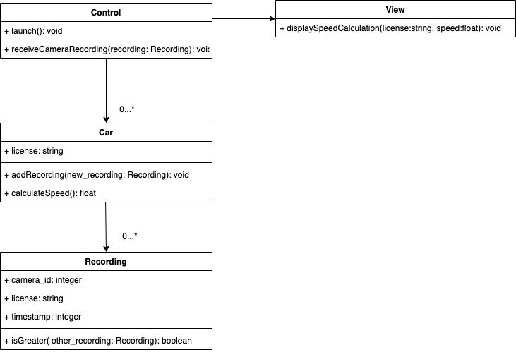

# Backend Interview Solution

This is a recreation of the code I created during my backend technical interview.

## Setup

This project was built using <a href="https://www.ruby-lang.org/en/news/2019/04/17/ruby-2-6-3-released/">Ruby 2.6.3</a>

To run the project simply run:

```ruby
ruby main.rb
```

Within the Control.rb launch method you will see the following:

```ruby
def launch()
    initScenarioOne() # use first set of test inputs and outputs
    # initScenarioTwo() # use second set of test inputs and outputs
end
```

As described in the question prompt, the first batch of data is ordered by license plate and sorted in chronological order. The second batch of data simulates delay amongst cameras, meaning the data will not be sorted. To configure which batch of data should be used, uncomment the scenario method of your choosing.

## Classes



* **Control**: This class controls the flow of the program.
    * **recorded_cars**: A map where the keys are license plates that point to their associated car object. 
    * **view**: Object that handles the output of the program.
    * **launch()**: This method is the starting point of the program.
    * **receiveCameraRecording(recording)**: This method stores a received recording by adding it to the car with the same license plate in the recorded_cars map. If the associated car can have its speed calculated, it outputs whether the car was speeding with their average speed.

* **View**: This class controls the output of the program.
    * **displaySpeedCalculation(license, speed)**: A method that outputs a license and whether the car associated with the provided license plate was speeding.

* **Car**: This class represents a car associated with a given license plate
    * **license**: The car's unique license.
    * **recordings**: A collection of all recordings that were taking of a given car.
    * **addRecording(new_recording)**: A method that adds a new recording to the recordings array while ensuring that all recordings are sorted chronologically.
    * **calculateSpeed()**: A method that calculates and returns the average speed of the car.

* **Recording**: This class represents recording captured by one of the speed tracking cameras.
    * **camera_id**: The id of the camera the recording was taken from.
    * **license**: The associated car's unique license.
    * **timestamp**: Represents the time this recording was taken represented in seconds.
    * **isGreater(other_recording)**: This method compares the current recording to the one passed as a parameter and determines which is greater.

## Output

#### Scenario #1
```ruby
(ABC-123, true) (120.0 km/h)
(DEF-123, false) (100.0 km/h)
(GHI-123, false) (60.0 km/h)
(JKL-123, true) (102.9 km/h)
```

#### Scenario #2
```ruby
(ABC-123, true) (120.0 km/h)
(GHI-123, false) (60.0 km/h)
(JKL-123, true) (102.9 km/h)
(DEF-123, false) (100.0 km/h)
```